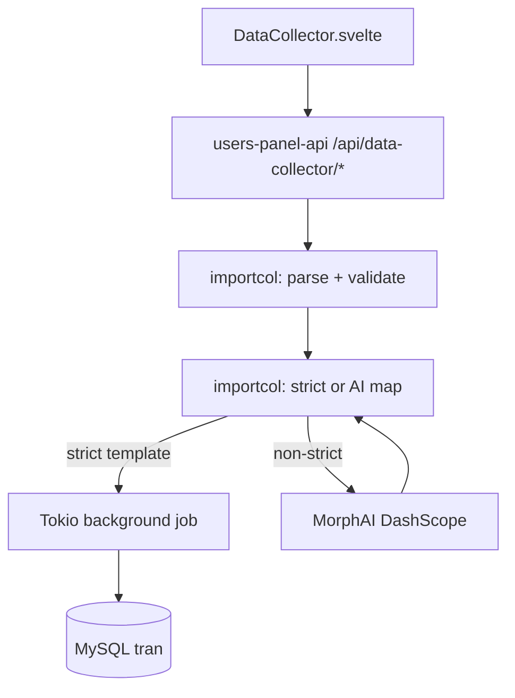

# Data Collector

Admin feature in **Users Panel** for bulk-importing MorphData records into the shared MySQL `tran` database.

## Architecture

## Flow

1. **Choose entity** — district, facility, member, employee, asset, activity, contact, user.
2. **Download template/example** — CSV or JSON per entity.
3. **Upload file** — CSV, JSON, or XLSX (first sheet).
4. **Validate sample** — checks headers, required columns, and first rows.
5. **Start import** — background job with progress (`percent`, `processed_rows` / `total_rows`).
6. **Results** — descriptive summary plus per-row success/failure (up to 500 rows in response).

## Strict template (no AI)

If file headers match the entity template **exactly**, import maps columns 1:1 and skips AI calls.

## AI-assisted path

When headers differ:

- One AI call maps columns to MorphData fields.
- Unmapped columns go to `detail` JSON (Mongo persistence can be added in a follow-up).
- Missing `description` may be generated from the row via AI.

Requires `MORPH_AI_API_KEY`.

## API

| Method | Path | Description |
|--------|------|-------------|
| GET | `/api/data-collector/entities` | List entity specs + templates |
| GET | `/api/data-collector/templates/:entity` | Single entity spec |
| GET | `/api/data-collector/mock-data/:entity/:format` | Download mock CSV/JSON (`csv` or `json`) with 10 test rows |
| POST | `/api/data-collector/validate` | Multipart: `entity`, `file` |
| POST | `/api/data-collector/jobs` | Start background import |
| GET | `/api/data-collector/jobs/:job_id` | Poll job status |

Admin JWT required.

## Mock test data

Bundled files live in `UsersPanel/mock-data/morphdata/` — **10 realistic rows per entity** (Oregon school-district theme). In **Data Collector → Data Type**, use **Mock CSV** or **Mock JSON**, or upload from disk.

Recommended import order: **district → facility → member / employee → asset, activity, contact, user**.

See [`mock-data/README.md`](../mock-data/README.md).

## AI Assistant

Ask in the platform assistant, e.g. *How do I import members CSV?* — intent `data_collector_help` returns templates and examples.
