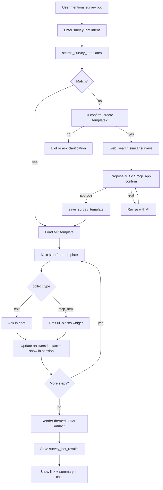

# Survey Bot + Morph Knowledge GraphRAG Plan

**Status:** Ready for implementation (awaiting approval)  
**Depends on:** [`docs/MORPH_GRAPH_RAG_PLAN.md`](./MORPH_GRAPH_RAG_PLAN.md) (Neo4j, outbox, worker)  
**Decisions locked from product:**

| # | Decision |
|---|----------|
| Survey answers | Stay visible in chat session **and** save as themed HTML |
| Survey HTML | FormsX theme-consistent; new FormsX **Survey Bot** module to view |
| Templates | Markdown templates; create/edit in module **with AI** |
| AI access | MorphAI + FormsX assistant can fetch survey HTML/results |
| Graph file uploads | **Morph only** (not FormsX/ComposerX) |
| Graph entity sync | MorphData + FormsX + ComposerX (existing GraphRAG plan) + **daily sync** |

---

## Feature 1 — FormsX Survey Bot

### Goal

When a user message starts with or includes **“survey bot”**, FormsX MorphAI enters a guided interview: a **markdown template** drives which questions to ask and which answers to collect via chat vs **MCP-app HTML widgets** (e.g. gender `<select>`). Answers accumulate in session state; on completion a **themed HTML artifact** is saved and listed in a new FormsX module. If no suitable template exists, the AI offers to create one (web research + user decisions via MCP-app UI).

### Trigger and state

- Detect: case-insensitive substring `survey bot` in the latest user message (or active `state.intent == "survey_bot"`).
- Extend assistant state in [`formx/backend/internal/handler/assistant.go`](../formx/backend/internal/handler/assistant.go):

```json
{
  "intent": "survey_bot",
  "fields": {},
  "survey_bot": {
    "template_id": "...",
    "step_index": 0,
    "answers": { "name": "Ada", "gender": "female" },
    "status": "running|awaiting_ui|completed|creating_template"
  }
}
```

- Wire in [`assistant_llm.go`](../formx/backend/internal/handler/assistant_llm.go): if Survey Bot active, use dedicated system instructions + tools (below) instead of generic form-CRUD-first behavior.

### Markdown template format

Stored in Mongo `athena` collection `survey_bot_templates` (FormsX Mongo).

Example:

```markdown
---
id: onboarding-v1
title: Staff onboarding survey
tags: [onboarding, hr]
---

# Instructions
Ask one question at a time. Do not skip required fields.

## Q1 — Full name
- field: name
- collect: text
- required: true
- prompt: What is your full name?

## Q2 — Gender
- field: gender
- collect: mcp_html
- widget: select
- options: [Female, Male, Non-binary, Prefer not to say]
- required: true
- prompt: Please select your gender.

## Q3 — Notes
- field: notes
- collect: text
- required: false
- prompt: Anything else we should know?
```

Parser: `formx/backend/internal/surveybot/template.go` — YAML frontmatter + `## Qn` sections → structured `SurveyStep[]`.

### MCP-app HTML collection (chat UI)

Extend MorphAI assistant response contract (FormsX + [`platform-chat`](../platform-chat/)):

```json
{
  "assistant_message": "Please select your gender.",
  "intent": "survey_bot",
  "state": { "...": "..." },
  "ui_blocks": [
    {
      "type": "mcp_app",
      "widget": "select",
      "id": "gender",
      "label": "Gender",
      "options": [
        { "value": "female", "label": "Female" },
        { "value": "male", "label": "Male" }
      ],
      "submit_as": { "field": "gender" }
    }
  ]
}
```

Allowlisted widgets (V1): `select`, `multiselect`, `confirm` (yes/no for “create template?” / approve draft MD).

[`platform-chat`](../platform-chat/) changes:

- Parse `ui_blocks` from assistant response in `usePlatformChat.ts`.
- Render interactive controls under the assistant bubble (React + Svelte).
- On submit, append a user message like `survey_bot_answer:gender=female` (or structured POST body field) and continue the loop.

Backend: tool `submit_survey_answer` or parse structured user replies into `state.survey_bot.answers` and advance `step_index`.

### Runtime flow



### Themed HTML artifact

- Renderer: `formx/backend/internal/surveybot/html_render.go`
- Embed FormsX theme tokens (sky/slate light + dark-friendly CSS matching [`formx/frontend/src/index.css`](../formx/frontend/src/index.css) and Layout nav colors `#0f4c66` / sky accents).
- Output: self-contained HTML file (inline CSS) stored:
  - Mongo `survey_bot_results` metadata + `html` body (or file path under `UPLOAD_DIR/survey-bot/{id}.html`)
  - Fields: `id`, `template_id`, `title`, `answers` JSON, `html`, `created_by`, `created_at`, `session_id`

### New FormsX module: Survey Bot

Frontend (mirror Events & Info pattern):

| Piece | Path |
|-------|------|
| Nav + route | [`Layout.tsx`](../formx/frontend/src/components/Layout.tsx), [`App.tsx`](../formx/frontend/src/App.tsx) → `/survey-bot` |
| Page | `formx/frontend/src/pages/SurveyBot.tsx` |
| Tabs | **Results** (list + HTML preview iframe) · **Templates** (list/edit MD + “Create with AI”) |

API routes (FormsX):

| Method | Path | Purpose |
|--------|------|---------|
| GET/POST | `/api/v1/survey-bot/templates` | List / create template |
| GET/PUT/DELETE | `/api/v1/survey-bot/templates/:id` | CRUD |
| POST | `/api/v1/survey-bot/templates/ai-draft` | Web-grounded MD draft (reuse `pkg/webresearch` + MorphAI) |
| GET | `/api/v1/survey-bot/results` | List results |
| GET | `/api/v1/survey-bot/results/:id` | Metadata + HTML |
| GET | `/api/v1/survey-bot/results/:id/html` | Raw HTML for iframe |

Templates tab “Create with AI”: chat/panel similar to [`FormTemplateAIPanel.tsx`](../formx/frontend/src/components/FormTemplateAIPanel.tsx) — research → propose MD → user edits → save.

### Assistant tools (FormsX + Morph proxy)

| Tool | Purpose |
|------|---------|
| `search_survey_templates` | Match user need to MD templates |
| `get_survey_template` | Load full MD |
| `save_survey_template` | Persist new/edited MD |
| `draft_survey_template_ai` | Web search + draft MD |
| `submit_survey_answer` | Record answer, advance step |
| `render_survey_result` | Finalize HTML + persist |
| `list_survey_results` / `get_survey_result` | Fetch for display/Q&A |

MorphData management chat: allowlist proxy to FormsX `/api/formsx/…/survey-bot/…` in [`internal_api.go`](../morph/handlers/internal_api.go) so MorphAI can fetch results too.

Update [`AI_ASSISTANT_MORPHAI_CONTRACT.md`](../AI_ASSISTANT_MORPHAI_CONTRACT.md) with `ui_blocks` + `survey_bot` state.

### Seed templates

Ship 2–3 starter MD files under `formx/backend/internal/surveybot/seeds/` (onboarding, feedback, event RSVP) loaded on first boot if collection empty.

---

## Feature 2 — Morph-designated Knowledge GraphRAG

### Goal

A **designated Neo4j GraphRAG** for MorphAI speed: sync platform entities (Morph + FormsX + ComposerX per existing plan) **every day**, plus a **Morph-only Knowledge Library** for uploaded `md|json|csv|pdf|txt` files that become graph `Chunk` nodes for all Morph assistant turns.

### Relationship to existing plan

Implement [`MORPH_GRAPH_RAG_PLAN.md`](./MORPH_GRAPH_RAG_PLAN.md) with these additions:

| Addition | Detail |
|----------|--------|
| Daily sync | `morphgraph-worker sync --daily` via cron/launchd (native, no Docker) — full reconcile + catch-up outbox |
| Morph Knowledge Library | Durable uploads → Neo4j; **not** session HybridContext |
| Upload formats | `.md`, `.json`, `.csv`, `.pdf`, `.txt` |
| Upload home | **Morph only** UI + API |
| Assistants | Morph chat prefers `graph_search` first; FormsX/ComposerX use entity graph tools but **no** file-upload UI |

### Morph Knowledge Library

```text
User uploads file in Morph
  → store on disk (/data/knowledge/…) + MySQL/Mongo metadata
  → enqueue graph_sync_outbox (source=morph, type=knowledge_file)
  → worker: extract text → chunk → embed → Chunk nodes DESCRIBES KnowledgeFile
  → Morph AI graph_search retrieves alongside entity chunks
```

API (Morph):

| Method | Path | Purpose |
|--------|------|---------|
| GET | `/api/knowledge/files` | List library |
| POST | `/api/knowledge/files` | Upload (multipart) |
| GET | `/api/knowledge/files/:id` | Metadata |
| DELETE | `/api/knowledge/files/:id` | Delete + graph delete |
| POST | `/api/graph/search` | Shared GraphRAG (entities + knowledge) |

UI: new Morph panel **Knowledge** (or extend HybridContext area with tabs: Session context | Knowledge library). Session HybridContext stays temporary; Knowledge library persists and syncs to graph.

Text extraction:

| Type | Approach |
|------|----------|
| md/txt | Raw |
| json | Pretty-print / flatten keys |
| csv | Header + row summaries (cap rows) |
| pdf | Reuse ComposerX PDF path / existing Morph PDF reader if available |

### Daily sync

Worker schedule (documented in DEPLOY-README + GraphRAG doc):

```bash
# launchd / crontab example — 03:00 local
morphgraph-worker sync --mode=daily --sources=morph,formsx,composerx,knowledge
```

Daily job:

1. Drain outbox.
2. Reconcile counts (MySQL/Mongo vs Neo4j); re-upsert drift.
3. Re-embed knowledge files with `updated_at` changes.
4. Emit metrics: lag, node counts, embed failures.

### Morph assistant integration

- System prompt: prefer `graph_search` for platform + knowledge questions.
- Keep HybridContext for “this chat only” attachments.
- FormsX/ComposerX: entity `graph_*` tools only; no knowledge upload endpoints.

---

## Implementation phases

### Phase A — Survey Bot core (FormsX)

1. Mongo models + repos for templates/results.
2. MD parser + themed HTML renderer + seed templates.
3. Assistant mode detection, tools, answer accumulation.
4. API routes for templates/results.
5. Contract: `ui_blocks` on assistant response.

### Phase B — MCP-app UI + Survey Bot module

1. `platform-chat` render/submit for `select` / `confirm` / `multiselect`.
2. FormsX nav + `SurveyBot.tsx` (Results + Templates + AI draft panel).
3. Wire FormsX chat to show live answers in-session (state summary strip or markdown checklist).
4. Morph proxy + tools to fetch survey results.

### Phase C — GraphRAG foundation + Morph knowledge

1. `pkg/morphgraph` + outbox + worker (from GraphRAG plan).
2. Morph entity sync hooks + backfill.
3. Knowledge Library API + Morph UI upload.
4. Chunk/embed knowledge files into Neo4j.
5. Morph `graph_search` in management chat.

### Phase D — Daily sync + FormsX/ComposerX entity graph + harden

1. Daily sync command + ops docs.
2. FormsX + ComposerX entity mappers/hooks + assistant `graph_*` tools.
3. Golden tests: Survey Bot happy path; knowledge upload → search; daily sync dry-run.
4. Update MorphAI contract, fast-ops skill, DEPLOY-README (Neo4j + cron).

---

## Acceptance criteria

**Survey Bot**

1. Message containing “survey bot” enters guided mode.
2. Matching template drives text + HTML-select collection; answers visible in session.
3. Completion writes themed HTML; visible in FormsX Survey Bot module.
4. No template → offer create → web draft → user confirms via MCP-app → template saved.
5. Module can create/edit MD templates with AI.
6. FormsX AI and MorphAI can list/get survey results via tools.

**GraphRAG / Knowledge**

1. Neo4j receives Morph/FormsX/ComposerX entity sync + Morph knowledge files.
2. Morph-only upload for md/json/csv/pdf/txt; searchable via `graph_search`.
3. Daily sync job documented and runnable.
4. HybridContext remains session-scoped and separate from Knowledge Library.

---

## Key files to touch

| Area | Files |
|------|--------|
| FormsX assistant | `formx/backend/internal/handler/assistant*.go` |
| Survey Bot package | `formx/backend/internal/surveybot/*` (new) |
| FormsX UI | `App.tsx`, `Layout.tsx`, `pages/SurveyBot.tsx` (new) |
| Chat widgets | `platform-chat/usePlatformChat.ts`, React/Svelte drawers |
| Morph knowledge | `morph/handlers/knowledge_*.go` (new), frontend Knowledge panel |
| Graph | `pkg/morphgraph/*`, `morphgraph-worker` (new, per GraphRAG plan) |
| Docs | this file, `MORPH_GRAPH_RAG_PLAN.md`, contract, DEPLOY-README |

---

*Approve this plan to begin Phase A implementation.*
